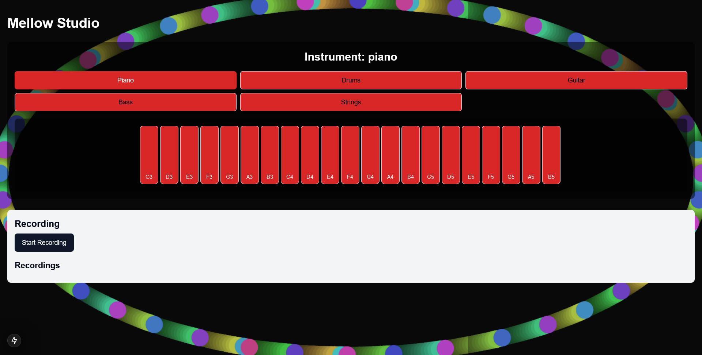
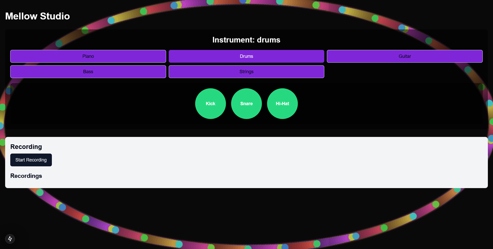
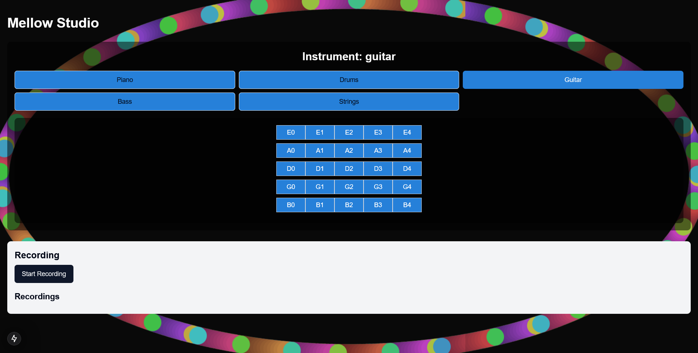
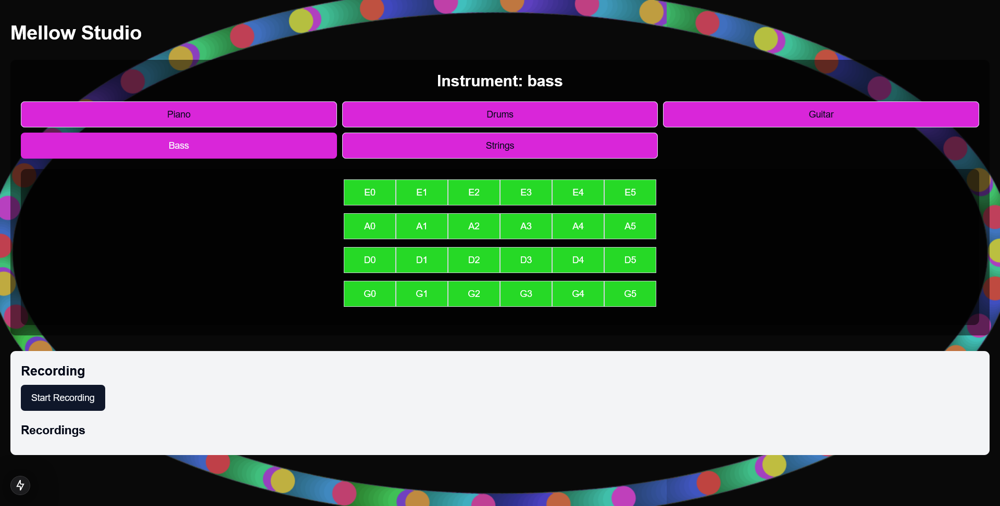
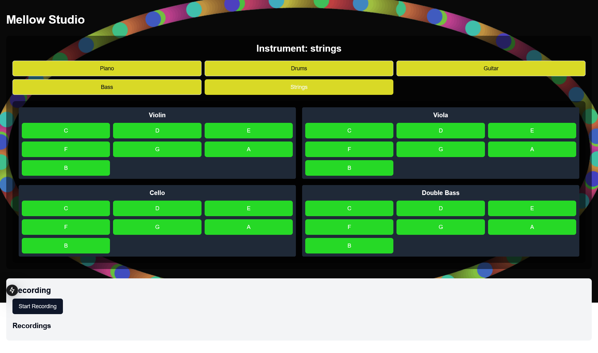
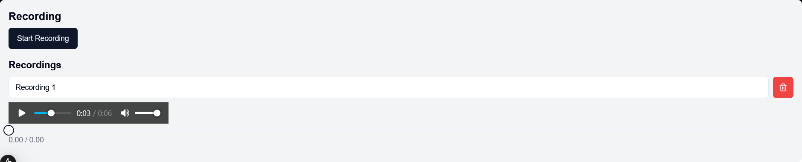

[](https://github.com/gongahkia/mellow/releases/tag/1.0.0) 

# `Mellow` 👽

Psychedelic [GarageBand](https://www.apple.com/sg/mac/garageband/) that runs in the browser.

Implemented in just over [4 hours](https://github.com/gongahkia/mellow/commit/27ff901b95517eae0281b593d0a7ffc768b8e244).

Here's [why](#retrospect) I did it.

## Usage

Build [Mellow](https://github.com/gongahkia/mellow) locally.

```console
$ git clone https://github.com/gongahkia/mellow
$ cd mellow/src/mellows
$ npm install @radix-ui/react-slider lucide-react class-variance-authority clsx tailwind-merge
$ npx shadcn@latest add button input slider
$ npm run dev
```

Then visit [`http://localhost:3000`](http://localhost:3000).

## Screenshots










## Retrospect

I made [Mellow](https://github.com/gongahkia/mellow) with React, Tailwind CSS and Next.JS to benchmark my progress and understanding in writing quick and dirty web apps.  

Just for ***'fun'***, I also challenged myself to do it in one sitting, no toilet breaks, no water breaks, no nothing. I started work at 9.45pm on 27 January 2025. As I type this now, it is nearing 2:21am on 28 January 2025. [I am never doing this again](https://i.imgflip.com/2ww4ky.png?a482496). 

## Other comments

Working *(wrestling)* with the [Web Audio API](https://developer.mozilla.org/en-US/docs/Web/API/Web_Audio_API) and [MediaRecorder API](https://developer.mozilla.org/en-US/docs/Web/API/MediaRecorder) was an absolute nightmare and very near the death of me. 


